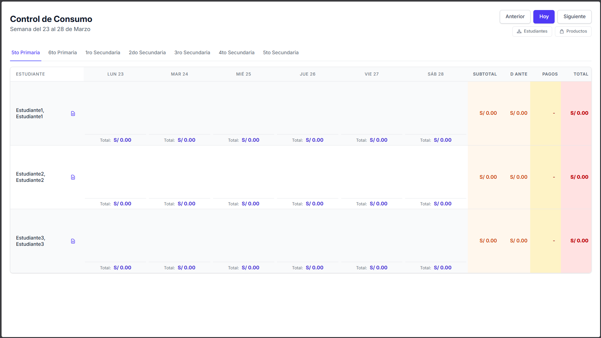
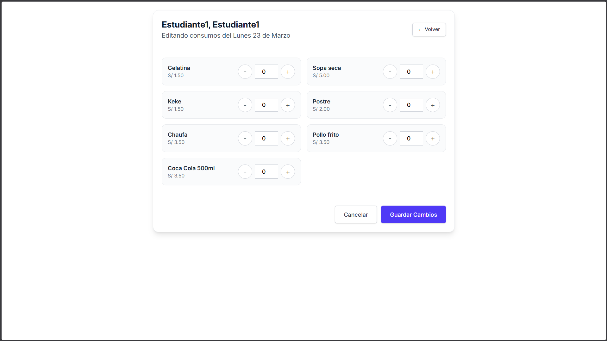

# Kiosco - Sistema de Control de Consumo Escolar

Sistema web optimizado desarrollado en **GoLang** para gestionar consumos, pagos y deudas de estudiantes en kioscos escolares.



## Características Principales

- **Vista Semanal:** Resumen completo de consumos por estudiante para la semana actual o cualquier semana seleccionada
- **Filtrado por Grado:** Navegación rápida entre diferentes grados escolares (Primaria/Secundaria)
- **Registro de Consumos:** Interfaz ágil para añadir/modificar consumos de productos por estudiante y fecha
- **Gestión de Pagos:** Sistema de registro de pagos con historial detallado por estudiante
- **Cálculo Automático de Deuda:**
    - **Deuda Anterior:** Acumulado de semanas previas
    - **Subtotal Semanal:** Suma de consumos de la semana
    - **Pagos/Descuentos:** Montos abonados durante el período
    - **Deuda Total:** Cálculo en tiempo real
- **Edición Diaria:** Vista dedicada para modificar todos los productos consumidos en un día específico
- **Días no Hábiles:** Configuración de feriados/días no laborables
- **Interfaz Optimizada:** Diseño responsivo con TailwindCSS, ideal para ventas rápidas

## Vista Previa del Sistema

### Vista Principal - Control Semanal


### Edición de Consumos Diarios


## Tecnologías Utilizadas

- **Backend:** Go 1.24.6 (stdlib puro, sin frameworks)
- **Base de Datos:** PostgreSQL 14+ (queries optimizadas, 10+ índices)
- **Frontend:** HTML5, TailwindCSS CLI, JavaScript vanilla
- **Arquitectura:** MVC-like con separación de capas (Repository Pattern)

## Inicio Rápido

### Prerrequisitos

- **Go 1.24.6**: [Descargar Go](https://go.dev/dl/)
- **PostgreSQL 17**: Local o remoto (Neon, Supabase, etc.)
- **Git**: Para clonar el repositorio

### Instalación

#### 1. Clonar el Repositorio
```bash
git clone https://github.com/FernandoYZ/kiosco.git
cd kiosco
```

#### 2. Configurar la Base de Datos

**Creación de la Base de datos Local o remoto**
```sql
-- Crear la base de datos
CREATE DATABASE Kiosco;
```

- Copia el contenido de `db.pgsql`
- Pégalo en el SQL Editor de tu proveedor o en el gestor de tu máquina local
- Ejecuta el script

#### 3. Configuración y Ejecución en Desarrollo

Para ejecutar la aplicación en tu máquina local, necesitas configurar las variables de entorno (como la contraseña de la base de datos) y luego iniciar el programa Go.

- `run.example.bat` (Para Windows)

- `run.example.sh` (Para Linux / macOS)

**Windows:**

**Paso 1: Copiar la plantilla**
En `cmd` o `PowerShell`, crea una copia del script de plantilla. Nunca edites el archivo `.example` directamente.

**Archivo `env.bat` (Windows):**
```bat
@echo off
set DB_USER=postgres
set DB_PASSWORD=tu_contraseña_real
set DB_HOST=localhost
set DB_PORT=5432
set DB_NAME=Kiosco
set PGSSLMODE=disable

go run ./cmd/kiosco
pause
```

```bash
# Copia la plantilla
copy run.example.bat run.bat
```

**Paso 2: Editar el script**
Abre el nuevo archivo `run.bat` con cualquier editor de texto (como Notepad) y completa tus credenciales, especialmente `DB_PASSWORD`.

```bash
# Abrir con el Bloc de notas
notepad run.bat
```

**Paso 3: Ejecutar la aplicación**
Simplemente ejecuta el script. Cargará las variables y lanzará la aplicación.

```bash
# Ejecuta el script
.\run.bat
```

La aplicación se estará ejecutando en tu terminal.

---

**Linux/macOS:**

**Paso 1: Copiar la plantilla**
En tu terminal, crea una copia del script de plantilla.

```sh
# Copia la plantilla
cp run.example.sh run.sh
```

**Archivo `env.sh` (Mac/Linux):**
```sh
# Configuración de base de datos
export DB_USER="postgres"
export DB_PASSWORD="TU_CONTRASEÑA_AQUI"
export DB_HOST="localhost"
export DB_PORT="5432"
export DB_NAME="Kiosco"
export PGSSLMODE="disable"

# --- Confirmar que las variables de entorno se cargaron correctamente ---
echo "[env] Variables de entorno cargadas con exito."

# --- Ejecutar la aplicación Go ---
echo "[app] Ejecutando la aplicacion Go desde cmd/kiosco..."
go run ./cmd/kiosco
```

**Paso 2: Editar el script**
Abre el nuevo archivo `run.sh` con cualquier editor de texto y completa tus credenciales, especialmente `DB_PASSWORD`.

```sh
# Abrir con el editor nano (o el de tu preferencia)
nano run.sh
```

**Paso 3: Dar permisos de ejecución**
En Linux y macOS, necesitas hacer que el script sea ejecutable. *Solo necesitas hacer esto una vez*.

```sh
chmod +x run.sh
```

**Paso 4: Ejecutar la aplicación**
Ejecuta el script para cargar las variables y lanzar la aplicación.

```sh
# Ejecuta el script de shell
./run.sh
```


#### 4. Compilación (Opcional)

Si prefieres compilar la aplicación en un solo binario en lugar de `usar go` run en cada ejecución:

```go
# Compilar para Windows
go build -o kiosco.exe ./cmd/kiosco

# Compilar para Linux/macOS
go build -o kiosco ./cmd/kiosco
```

**Para ejecutar el binario compilado:**
Aún necesitas las variables de entorno. La forma más fácil es modificar tus scripts `run.bat` o `run.sh`:

1. Busca la última línea `go run ./cmd/kiosco`.

2. Cámbiala por `./kiosco.exe` (en Windows) o `./kiosco` (en Linux/Mac).

3. Vuelve a ejecutar el script `.\run.bat` o `./run.sh`.

```sh
# Compilar
go build -o kiosco.exe ./cmd/kiosco  # Windows
go build -o kiosco ./cmd/kiosco      # Linux/macOS

# Ejecutar
./kiosco.exe  # Windows
./kiosco      # Linux/macOS
```

#### 5. Acceder a la Aplicación
Abre tu navegador en: **http://localhost:3200**

## Estructura del Proyecto

```
kiosco/
├── cmd/
│   └── kiosco/
│       └── main.go             # Punto de entrada de la aplicación
│
├── internal/                   # Código privado (no exportable)
│   ├── config/
│   │   └── config.go           # Configuración de variables de entorno
│   │
│   ├── db/
│   │   └── conexion.go         # Pool de conexiones PostgreSQL
│   │
│   ├── models/                 # Modelos de datos
│   │   ├── estudiante.go
│   │   ├── grado.go
│   │   ├── producto.go
│   │   ├── consumo.go
│   │   ├── pago.go
│   │   └── common.go           # DTOs compartidos
│   │
│   ├── repositories/           # Capa de acceso a datos (Repository Pattern)
│   │   ├── repository.go       # Estructura base
│   │   ├── estudiante.go       # Queries de estudiantes
│   │   ├── producto.go         # Queries de productos
│   │   ├── consumo.go          # Queries de consumos
│   │   └── pago.go             # Queries de pagos
│   │
│   ├── services/               # Lógica de negocio
│   │   └── services.go
│   │
│   ├── controllers/            # Controladores HTTP
│   │   ├── base.go             # Estructura base del controlador
│   │   ├── vistas_controller.go
│   │   ├── consumos_controller.go
│   │   └── pagos_controller.go
│   │
│   ├── router/                 # Configuración de rutas
│   │   └── router.go
│   │
│   ├── middleware/             # Middleware HTTP
│   │   └── logger.go           # Logging y recuperación de panics
│   │
│   ├── views/                  # Plantillas HTML
│   │   ├── layouts/
│   │   │   └── base.tmpl       # Layout base compartido
│   │   ├── index.tmpl
│   │   ├── editar_consumos.tmpl
│   │   ├── editar_pagos.tmpl
│   │   └── ver_consumo_semanal.tmpl
│   │
│   └── utils/                  # Utilidades
│       ├── templates.go        # Funciones para templates
│       └── fechas.go           # Utilidades de fechas
│
├── static/                     # Archivos estáticos
│   └── css/
│       ├── estilos.css
│       └── styles.css
│
├── assets/                     # Recursos (imágenes, docs)
│   └── images/
│       └── *.png               # Capturas del sistema
│
├── db.pgsql                    # Script SQL de la base de datos
├── Dockerfile                  # Configuración de contenedor Docker
├── .dockerignore               # Archivos excluidos de Docker
├── env.example.bat             # Plantilla de variables de entorno (Windows)
├── go.mod                      # Dependencias del proyecto
├── go.sum                      # Checksums de dependencias
└── README.md                   # Este archivo
```

### Convenciones Adoptadas

- **Estructura estándar de Go**: `cmd/` (ejecutables) + `internal/` (código privado)
- **Separación por capas**: Models → Repositories → Services → Controllers
- **Package names en inglés**: Convención de Go (controllers, repositories, etc.)
- **Código en español**: Funciones, variables y comentarios para facilitar el mantenimiento

## Rutas de la Aplicación

La aplicación usa **renderizado del lado del servidor** (SSR) con templates HTML.

| Método | Ruta | Descripción | Parámetros |
|--------|------|-------------|------------|
| `GET` | `/` | Vista principal con tabla de consumos semanal | `?fecha=YYYY-MM-DD`, `?grado=ID`, `?dias_off=YYYY-MM-DD,YYYY-MM-DD` |
| `POST` | `/registrar-consumo` | Registrar/actualizar consumo de producto | `id_estudiante`, `id_producto`, `cantidad`, `fecha` |
| `POST` | `/registrar-pago` | Registrar pago de estudiante | `id_estudiante`, `monto`, `fecha_pago` |
| `GET` | `/editar-consumos` | Vista de edición de consumos diarios | `?id_estudiante=ID`, `?fecha=YYYY-MM-DD` |
| `POST` | `/guardar-consumos-dia` | Guardar cambios de edición diaria | `id_estudiante`, `fecha`, `productos[]` |
| `GET` | `/editar-pagos` | Vista de gestión de pagos | `?id_estudiante=ID`, `?fecha=YYYY-MM-DD` |
| `POST` | `/eliminar-pago` | Eliminar un pago registrado | `id_pago` |

## Optimizaciones de Rendimiento

### Base de Datos
- **10+ índices optimizados** para consultas frecuentes
- **Queries batch** para reducir round-trips a la DB
- **Índices compuestos** en columnas más consultadas (IdEstudiante, FechaConsumo, etc.)
- **Índice parcial** en `Estudiantes.EstaActivo = true` (solo indexa activos)
- Pool de conexiones configurado: `MaxOpenConns = 2`, `MaxIdleConns = 2`

### Backend
- **Sin frameworks web**: net/http (reducción de overhead)
- **Sin ORM**: SQL con prepared statements (máxima velocidad)
- **Templates compilados** en memoria al inicio
- **Batch queries** para obtener deudas/pagos de todos los estudiantes en una sola consulta
- **Pre-asignación de memoria** en maps y slices

### Resultados
- **~50-70% más rápido** en consultas con índices vs sin índices
- **~60-80% más rápido** en cálculos de deudas con batch queries
- **<100ms** de respuesta con 200-500 estudiantes (PostgreSQL local)
- **200-400ms** con PostgreSQL remoto (Neon/Supabase)

## Deployment

### Docker
```bash
# Construir imagen
docker build -t kiosco .

# Ejecutar contenedor
docker run -p 3200:3200 \
  -e DB_USER=postgres \
  -e DB_PASSWORD=tu_contraseña \
  -e DB_HOST=tu_host \
  -e DB_PORT=5432 \
  -e DB_NAME=Kiosco \
  kiosco
```

## Contacto

**Desarrollador**: Fernando YZ
**GitHub**: [@FernandoYZ](https://github.com/FernandoYZ)
**Proyecto**: [github.com/FernandoYZ/kiosco](https://github.com/FernandoYZ/kiosco)