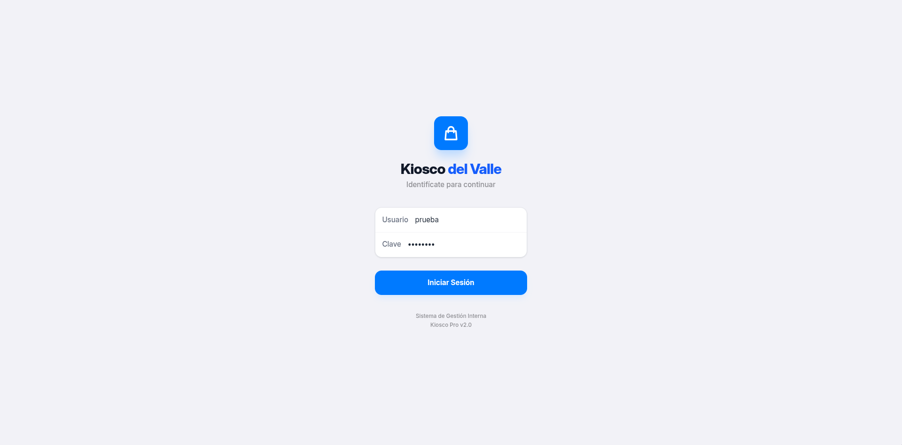
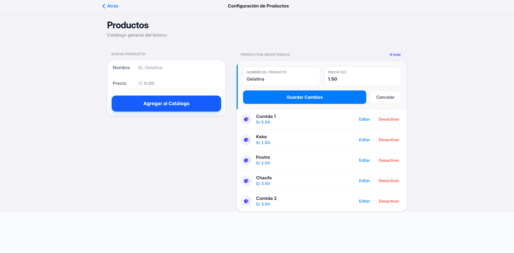
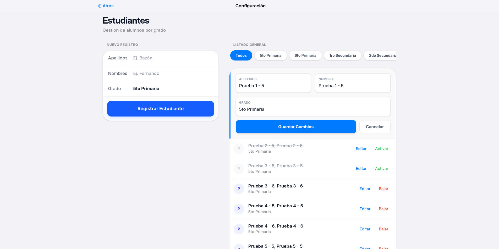

# Kiosco - Sistema de Control de Consumo Escolar

Sistema web ligero y eficiente para gestionar consumos, pagos y deudas de estudiantes en kioscos escolares. Construido con **Go** y **SQLite** embebido: sin dependencias externas pesadas, sin Docker, un solo binario autocontenido.

---
### Credenciales de Acceso
Para probar el sistema sin configuración previa, utiliza:
| Usuario | Contraseña |
|------|------------|
| prueba | pa$$w0rD |

> [!IMPORTANT]
> Estas credenciales son solo para pruebas. En un entorno real, debes cambiarlas inmediatamente en el archivo `internal/config/schema.sql`.

> [!NOTE]
> El sistema crea automáticamente estos accesos en el primer arranque si no detecta una base de datos existente.

---
## Características principales

- **Vista semanal:** tabla de consumos por estudiante, grado y semana seleccionada
- **Filtrado por grado:** navegación rápida entre Primaria y Secundaria
- **Registro de consumos:** agregar y modificar consumos por producto, estudiante y fecha
- **Edición diaria:** vista dedicada para ajustar todos los productos de un día específico
- **Gestión de pagos:** registro de pagos con historial por estudiante
- **Cálculo de deuda en tiempo real:** deuda anterior + consumos de la semana − pagos
- **Setup de estudiantes:** CRUD completo con habilitación/deshabilitación
- **Setup de productos:** gestión de productos disponibles en el kiosco
- **Autenticación con sesiones firmadas:** cookies HMAC-SHA256, Argon2id para contraseñas
- **Binario autocontenido:** estáticos y schema SQL embebidos en el binario

> [!TIP]
> Este sistema está pensado para entornos escolares con recursos limitados: instalación simple y sin dependencias externas.

---
## Vista previa del sistema

### Vista general
<p align="center">
  
</p>

---

### Funcionalidades del sistema

| **Inicio de sesión** | **Productos** |
|-------------------|-------------|
|  |  |

| **Estudiantes** | **Consumos** |
|---------------|------------|
|  |  |

---
## Tecnologías utilizadas

| Capa | Tecnología |
|------|------------|
| Backend | Go 1.25+, `net/http` (sin frameworks) |
| Base de datos | SQLite (`modernc.org/sqlite` — pure Go, sin CGO) |
| Templates | `a-h/templ` — templates compilados a Go |
| Autenticación | `golang.org/x/crypto` — Argon2id |
| CSS | TailwindCSS v4 CLI |
| JS interactividad | Alpine.js 3.x, HTMX 2.x |
| Exportación | html-to-image |
| Build frontend | Bun |

---
## Inicio rápido

### Prerrequisitos

- [Go 1.25+](https://go.dev/dl/)
- [Bun](https://bun.sh/) — para compilar assets frontend
- [templ CLI](https://templ.guide/quick-start/installation) — para generar templates Go

### Desarrollo local

```bash
# 1. Instalar dependencias frontend
bun install

# 2. Compilar assets estáticos
bun run start:static

# 3. Generar templates Go
templ generate

# 4. Ejecutar la aplicación
go run ./cmd/kiosco
```

Acceder en: **http://localhost:3200**

> [!IMPORTANT]
> Debes ejecutar `templ generate` antes de iniciar la aplicación o las vistas no estarán disponibles.

Para desarrollar estilos con recarga automática:

```bash
bun run css:dev   # watch mode — observa cambios en assets/main.css
```
> [!TIP]
> Usa modo watch para recompilar automáticamente los estilos al guardar cambios.

Variables de entorno opcionales

| Variable | Por defecto |
|----------|-------------|
| `HOST` | `0.0.0.0` |
| `PORT` | `3200` |

> [!NOTE]
> No es obligatorio usar variables de entorno porque vienen por defecto
---
## CSS y JS personalizados

Los assets de entrada están en `assets/`:

- **`assets/main.css`** — punto de entrada de TailwindCSS. Agregar aquí estilos personalizados o directivas `@layer`.
- **`assets/main.js`** — punto de entrada de Bun. Agregar aquí código JavaScript propio.

Al ejecutar `bun run start:static`, estos archivos se compilan y minimizan en `public/dist/`. Los archivos en `public/` se embeben en el binario al compilar con `go build`.

---
## Rutas de la aplicación

### Rutas públicas

| Método | Ruta | Descripción |
|--------|------|-------------|
| `GET` | `/login` | Formulario de inicio de sesión |
| `POST` | `/login` | Procesar credenciales |
| `GET/POST` | `/logout` | Cerrar sesión |

### Rutas protegidas (requieren sesión)

| Método | Ruta | Descripción |
|--------|------|-------------|
| `GET` | `/` | Vista principal semanal |
| `GET/POST` | `/editar-consumos` | Editar consumos del día |
| `POST` | `/guardar-consumos-dia` | Guardar cambios de edición diaria |
| `POST` | `/registrar-consumo` | Registrar consumo |
| `GET/POST` | `/editar-pagos` | Gestión de pagos |
| `POST` | `/registrar-pago` | Registrar pago |
| `POST` | `/eliminar-pago` | Eliminar pago |
| `GET` | `/ver-consumo-semanal` | Ver resumen semanal |
| `GET/POST` | `/setup` | Configuración de estudiantes |
| `GET/POST` | `/setup/estudiante` | Crear estudiante |
| `POST` | `/setup/estudiante/actualizar` | Actualizar estudiante |
| `POST` | `/setup/estudiante/toggle` | Habilitar/deshabilitar estudiante |
| `GET/POST` | `/setup/productos` | Configuración de productos |
| `GET/POST` | `/setup/producto` | Crear producto |
| `POST` | `/setup/producto/actualizar` | Actualizar producto |
| `POST` | `/setup/producto/toggle` | Habilitar/deshabilitar producto |

---
## Estructura del proyecto

```
kiosco/
├── cmd/kiosco/main.go
├── internal/
├── templates/
├── assets/
├── public/                       # Estáticos generados (embebidos en el binario)
├── database/database.db          # Creado automáticamente en el primer arranque
├── assets.go                     # embed.FS para public/
├── go.mod
├── go.sum
└── package.json
```
---

## Contacto

**Desarrollador:** Fernando YZ
**GitHub:** [@FernandoYZ](https://github.com/FernandoYZ)
