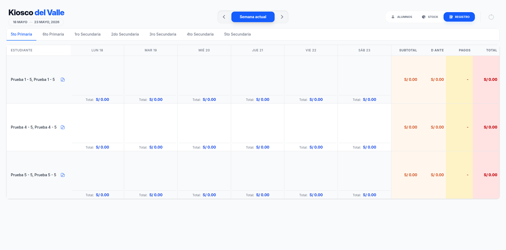
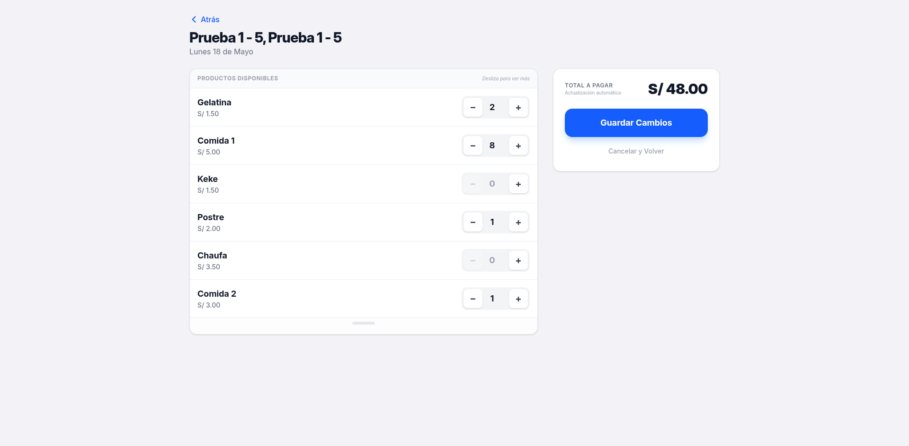

# Kiosco - Sistema de Control de Consumo Escolar

Sistema web para gestionar consumos, pagos y deudas de estudiantes en kioscos escolares. Desarrollado en Go puro con SQLite embebido — sin frameworks, sin Docker, un solo binario autocontenido.

## Características principales

- **Vista semanal:** tabla de consumos por estudiante, grado y semana seleccionada
- **Filtrado por grado:** navegación rápida entre Primaria y Secundaria
- **Registro de consumos:** agregar y modificar consumos por producto, estudiante y fecha
- **Edición diaria:** vista dedicada para ajustar todos los productos de un día específico
- **Gestión de pagos:** registro de pagos con historial por estudiante
- **Cálculo de deuda en tiempo real:** deuda anterior + consumos de la semana − pagos
- **Setup de estudiantes:** CRUD completo con habilitación/deshabilitación
- **Setup de productos:** gestión de productos disponibles en el kiosco
- **Autenticación con sesiones firmadas:** cookies HMAC-SHA256, Argon2id para contraseñas
- **Binario autocontenido:** estáticos y schema SQL embebidos en el binario

## Vista Previa del Sistema

### Vista Principal - Control Semanal


### Edición de Consumos Diarios


## Tecnologías utilizadas

| Capa | Tecnología |
|------|------------|
| Backend | Go 1.25+, `net/http` (sin frameworks) |
| Base de datos | SQLite (`modernc.org/sqlite` — pure Go, sin CGO) |
| Templates | `a-h/templ` — templates compilados a Go |
| Autenticación | `golang.org/x/crypto` — Argon2id |
| CSS | TailwindCSS v4 CLI |
| JS interactividad | Alpine.js 3.x, HTMX 2.x |
| Exportación | html-to-image |
| Build frontend | Bun |

## Inicio rápido

### Prerrequisitos

- [Go 1.25+](https://go.dev/dl/)
- [Bun](https://bun.sh/) — para compilar assets frontend
- [templ CLI](https://templ.guide/quick-start/installation) — para generar templates Go

### Desarrollo local

```bash
# 1. Instalar dependencias frontend
bun install

# 2. Compilar assets estáticos
bun run start:static

# 3. Generar templates Go
templ generate

# 4. Ejecutar la aplicación
go run ./cmd/kiosco
```

Acceder en: **http://localhost:3200**

Para desarrollar estilos con recarga automática:

```bash
bun run css:dev   # watch mode — observa cambios en assets/main.css
```

Variables de entorno opcionales (tienen valores por defecto):

| Variable | Por defecto |
|----------|-------------|
| `HOST` | `0.0.0.0` |
| `PORT` | `3200` |

## CSS y JS personalizados

Los assets de entrada están en `assets/`:

- **`assets/main.css`** — punto de entrada de TailwindCSS. Agregar aquí estilos personalizados o directivas `@layer`.
- **`assets/main.js`** — punto de entrada de Bun. Agregar aquí código JavaScript propio.

Al ejecutar `bun run start:static`, estos archivos se compilan y minimizan en `public/dist/`. Los archivos en `public/` se embeben en el binario al compilar con `go build`.

## Compilación y despliegue

### Compilar el binario

```bash
# Windows
go build -ldflags="-s -w" -o kiosco.exe ./cmd/kiosco

# Linux/macOS
CGO_ENABLED=0 GOOS=linux GOARCH=amd64 go build -ldflags="-s -w" -o kiosco ./cmd/kiosco
```

El binario resultante incluye todos los archivos estáticos y el schema SQL — no requiere archivos adicionales salvo la base de datos.

### Despliegue en VPS

```bash
scp kiosco user@vps:/app/
scp database/database.db user@vps:/app/database/
```

Luego en el servidor:

```bash
./kiosco
```

Si no existe `database/database.db`, se crea automáticamente con el schema y los datos iniciales (grados y productos por defecto).

### Crear usuario administrador

No existe ruta de registro. Los usuarios deben insertarse directamente en la base de datos con un hash Argon2id:

```sql
INSERT INTO usuarios (usuario, contrasenha, puede_editar)
VALUES ('admin', '$argon2id$v=19$...hash...', 1);
```

Usar una herramienta externa para generar el hash Argon2id antes de insertar.

## Rutas de la aplicación

### Rutas públicas

| Método | Ruta | Descripción |
|--------|------|-------------|
| `GET` | `/login` | Formulario de inicio de sesión |
| `POST` | `/login` | Procesar credenciales |
| `GET/POST` | `/logout` | Cerrar sesión |

### Rutas protegidas (requieren sesión)

| Método | Ruta | Descripción |
|--------|------|-------------|
| `GET` | `/` | Vista principal semanal |
| `GET/POST` | `/editar-consumos` | Editar consumos del día |
| `POST` | `/guardar-consumos-dia` | Guardar cambios de edición diaria |
| `POST` | `/registrar-consumo` | Registrar consumo |
| `GET/POST` | `/editar-pagos` | Gestión de pagos |
| `POST` | `/registrar-pago` | Registrar pago |
| `POST` | `/eliminar-pago` | Eliminar pago |
| `GET` | `/ver-consumo-semanal` | Ver resumen semanal |
| `GET/POST` | `/setup` | Configuración de estudiantes |
| `GET/POST` | `/setup/estudiante` | Crear estudiante |
| `POST` | `/setup/estudiante/actualizar` | Actualizar estudiante |
| `POST` | `/setup/estudiante/toggle` | Habilitar/deshabilitar estudiante |
| `GET/POST` | `/setup/productos` | Configuración de productos |
| `GET/POST` | `/setup/producto` | Crear producto |
| `POST` | `/setup/producto/actualizar` | Actualizar producto |
| `POST` | `/setup/producto/toggle` | Habilitar/deshabilitar producto |

## Estructura del proyecto

```
kiosco/
├── cmd/kiosco/main.go
├── internal/
│   ├── auth/auth.go              # Llave efímera, HMAC token, Argon2id
│   ├── config/
│   │   ├── config.go             # HOST/PORT env vars (default 0.0.0.0:3200)
│   │   ├── database.go           # Singleton SQLite + auto-init schema
│   │   ├── schema.sql            # Schema embebido en el binario
│   │   └── static.go             # Archivos estáticos embebidos (embed.FS)
│   ├── controllers/
│   │   ├── base.go
│   │   ├── auth_controller.go
│   │   ├── vistas_controller.go
│   │   ├── consumos_controller.go
│   │   ├── pagos_controller.go
│   │   ├── setup_controller.go
│   │   └── productos_controller.go
│   ├── middleware/middleware.go   # RequiereAuth, Proteger
│   ├── models/                   # Structs: Estudiante, Producto, Consumo, Pago, Usuario
│   ├── repositories/             # Acceso a datos SQLite
│   ├── router/router.go
│   ├── services/services.go
│   └── utils/
├── templates/
│   ├── layouts/default.templ
│   └── pages/
│       ├── login.templ
│       ├── inicio.templ
│       ├── setup_estudiantes.templ
│       ├── setup_productos.templ
│       ├── editar_consumos.templ
│       ├── editar_pagos.templ
│       └── ver_consumo_semanal.templ
├── assets/
│   ├── main.css                  # Estilos personalizados (entrada Tailwind)
│   └── main.js                   # JS personalizado (entrada Bun)
├── public/                       # Estáticos generados (embebidos en el binario)
│   ├── dist/
│   │   ├── styles.css
│   │   ├── alpine.min.js
│   │   ├── htmx.min.js
│   │   ├── canvas.min.js
│   │   └── bundle.min.js
│   ├── fonts/
│   └── favicon.webp
├── database/database.db          # Creado automáticamente en el primer arranque
├── assets.go                     # embed.FS para public/
├── go.mod
├── go.sum
└── package.json
```

## Contacto

**Desarrollador:** Fernando YZ
**GitHub:** [@FernandoYZ](https://github.com/FernandoYZ)
